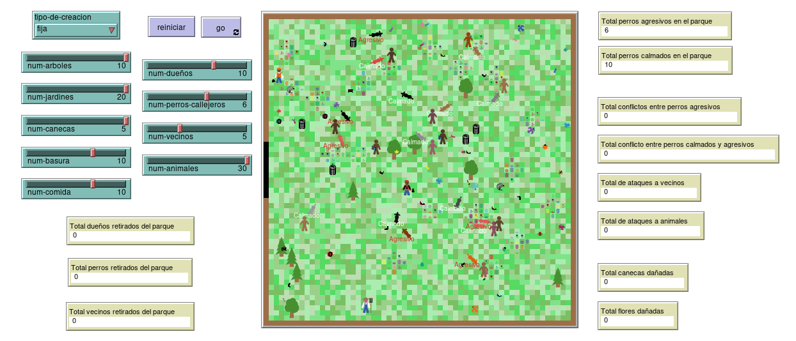

# Simulacion Paseo Parque

Simulación basada en Agentes de un paseo de dueños y sus mascotas _(perros)_ por un parque.

## Entorno

En el parque podemos encontrar cosas como:

- Árboles
- Jardines
- Basura
- Basureros
- Comida

También se pueden encontrar otros animales como:

- Perros Callejeros
- Pájaros
- Insectos
- Mariposas
- Ranas
- Ratones
- Ardillas

Además podemos encontrar personas (_vecinos_) como:

- Constructores
- Granjeros
- Leñadores
- Estudiantes
- Ejecutivos

## Acciones

Cuando los dueños llegan al parque con sus mascotas pueden hacer varias cosas:

- Pasear con sus mascotas al lado o dejar que descansen.
- Jugar a lanzar la pelota con sus mascotas y éstas la traen de vuelta, a veces pueden olvidar la pelota y dejarla por ahí, cuando la recuerdan la traen de vuelta al dueño.
- Pasear solos y dejar que sus mascotas paseen solas, esto solo se puede si son calmadas, si son agresivas deben llevar correa.

Cuando las mascotas están en el parque:

- Comer la comida que esté tirada en el piso.
- Comer la basura que esté tirada en el piso, si el dueño está cerca se van del parque.
- Si es agresivo puede dañar los jardines o basureros, si un vecino lo ve o el dueño está cerca se van del parque.
- Hacer popó, en dado caso el dueño tendrá que recogerla.
- Intentar huir del parque, si el dueño está cerca entonces regresa con él, sino el dueño se va del parque también.
- Si el dueño se va del parque, su mascota lo sigue.

Cuando las mascotas se encuentran con otros animales o vecinos:

- Juegan a dar vueltas.
- Si una mascota es agresiva (o un perro callejero) puede pelear o perseguir a otras mascotas, perros o vecinos.
- Si una mascota es agresiva (o un perro callejero) se pueden comer los insectos, pajaros y otros animales pequeños.
- Si dos perros son agresivos, pelean inmediatamente.

Cuando hay una pelea entre perros o con los vecinos:

- Los dueños pueden controlar a sus mascotas para parar la pelea.
- Cuando se pelean con vecinos, los perros son expulsados del parque.
- Cuando hay una pelea entre perros siempre hay uno que sale herido, y éste se va del parque lastimado.

## Reportes

Esta simulación permite registrar diferentes cantidades:

- Perros Agresivos y Calmados
- Perros expulsados del parque
- Peleas entre perros agresivos.
- Peleas entre perros agresivos y calmados.
- Jardines y Basureros dañados.
- Ataques a otros animales.
- Ataques hacia los vecinos.
- Vecinos retirados del parque
- Dueños retirados del parque
